<p align="center">
  
</p>

<div align="center">

# 🚀 Agentic PDF to Word & DOCX Studio
### خط لوله هوشمند استخراج خودکار کتاب و جزوه PDF به Word و PDF با هوش مصنوعی

[](https://python.org)
[](https://www.iso.org/standard/71691.html)
[](https://antigravity.google)
[](https://github.com)
[](LICENSE)

<br/>

<p align="center">
  <b>🇮🇷 فارسی</b> • <a href="README_EN.md"><b>🌐 Read this in English (English Documentation)</b></a>
</p>

<br/>

**[💡 رسالت پروژه](#-ایده-و-رسالت-پروژه-core-mission)** • **[🧩 معماری دو موتور و دو پرامپت](#-معماری-پروژه-دو-موتور-و-دو-پرامپت-the-2-engines--2-prompts-framework)** • **[⚡ شروع سریع](#-شروع-سریع-installation)** • **[🛠️ اجرای ۴ مرحله‌ای](#️-اجرای-مرحله-به-مرحله-چرخه-۴-مرحله‌ای)** • **[🖥️ رابط گرافیکی ویندوز](#️-رابط-کاربری-گرافیکی-ویندوز-windows-gui-studio)**

</div>

---

## 💡 ایده و رسالت پروژه (Core Mission)

> [!NOTE]
> **مسئله اساسی:** تبدیل کتاب‌ها، جزوه‌ها و مقالات طولانی PDF (۵۰ تا ۵۰۰ صفحه) به فایل ورد همواره با خطاهای جدی روبرو می‌شد:
> ۱. **اشباع حافظه (Context Bloat):** مدل‌های زبانی بعد از ۱۰ الی ۱۵ صفحه دچار پر شدن پنجره زمینه شده، به شدت کند می‌شوند یا به کل متوقف می‌گردند.
> ۲. **وارونگی پرانتزها و متون ترکیبی:** در متن‌های دوزبانه (فارسی + انگلیسی / نمادهای شیمی)، پرانتزها وارونه شده (`(Cl⁻)` به `)Cl⁻(`) و علامت‌های منفی جابجا می‌شوند.
> ۳. **فرمول‌های بی‌کیفیت:** معادلات ریاضی و روابط علمی تبدیل به تصاویر تار شطرنجی می‌شوند.
>
> **راهکار این پروژه:** یک معماری هوشمند مبتنی بر **دو موتور (2 Engines)** و **دو پرامپت (2 Prompts)** که کتاب‌ها و فایل‌های پی‌دی‌اف را با **صفر درصد اشباع حافظه (Zero Context Bloat)** استخراج کرده و سپس با موتور اختصاصی `md2docx` به اسناد رسمی Microsoft Word (`.docx`) و `PDF` دانشگاهی با فونت‌های استاندارد فارسی (`B Nazanin`، `B Titr`) و معادلات بومی برداری Word (OMML) تبدیل می‌کند.

---

## 🧩 معماری پروژه: دو موتور و دو پرامپت (The 2-Engines & 2-Prompts Framework)

این خط لوله کل فرآیند تبدیل را به ۴ مرحله ساده، خودکار و تضمین‌شده تقسیم می‌کند:

```mermaid
flowchart LR
    A["📄 PDF کتاب / جزوه"] -->|"موتور ۱<br/>scripts/pdf_to_cache.py"| B["🖼️ کش تصاویر ۱۰۵۰px<br/>(page_cache/)"]
    B -->|"پرامپت ۱"| C["📝 ساخت صفحه الگو<br/>(styling_reference.md)"]
    C -->|"تایید کاربر ✅"| D["🚀 پرامپت ۲ با goal/<br/>(استخراج صفحه به صفحه)"]
    D -->|"الحاق بدون اشباع حافظه"| E["📋 فایل کامل<br/>document.md"]
    E -->|"موتور ۲<br/>md2docx CLI / GUI"| F["📘 خروجی نهایی Word (.docx)<br/>و PDF دانشگاهی"]

    style A fill:#1e293b,stroke:#38bdf8,stroke-width:2px,color:#fff
    style B fill:#0f172a,stroke:#38bdf8,stroke-width:2px,color:#fff
    style C fill:#1e1b4b,stroke:#a855f7,stroke-width:2px,color:#fff
    style D fill:#312e81,stroke:#a855f7,stroke-width:2px,color:#fff
    style E fill:#064e3b,stroke:#10b981,stroke-width:2px,color:#fff
    style F fill:#065f46,stroke:#34d399,stroke-width:3px,color:#fff
```



1. **موتور اول (Engine 1 - PDF to Cache Engine):** اسکریپت چندنخی پایتون که تمام صفحات کتاب را در چند ثانیه به تصاویر استاندارد ۱۰۵۰ پیکسلی سبک در پوشه `page_cache/` تبدیل می‌کند.
2. **پرامپت اول (Prompt 1 - Template Markdown Generator):** هوش مصنوعی اولین صفحه محتوایی را بررسی کرده و سند الگوی سبک مارک‌داون (`styling_reference.md`) را می‌سازد.
3. **گام تایید کاربر (User Approval):** کاربر استایل هدینگ‌ها، فرمول‌ها و جداول را بررسی کرده و تایید نهایی می‌دهد.
4. **پرامپت دوم (Prompt 2 - Autonomous `/goal` Loop):** هوش مصنوعی با فرمان `/goal` صفحات را تک‌به‌تک استخراج کرده، موقتاً ذخیره و با پایتون به انتهای فایل الحاق می‌کند (حافظه همیشه خالی و سبک می‌ماند).
5. **موتور دوم (Engine 2 - Markdown to DOCX/PDF Engine):** موتور قدرتمند `md2docx` مارک‌داون تجمیع‌شده را به سند رسمی Word و خروجی مستقیم PDF با طرح جلد و فهرست مطالب تبدیل می‌کند.

---

## 🌟 جدول مقایسه ویژگی‌ها (Feature Matrix)

| ویژگی | ابزارهای سنتی (Pandoc / Abbyy / ChatGPT) | استودیوی هوشمند Agentic PDF-to-Word |
| :--- | :--- | :--- |
| **طول سند قابل پردازش** | محدود به ۱۰ الی ۲۰ صفحه به علت اشباع حافظه | **نامحدود (۱۰۰+ صفحه)** به دلیل الحاق تک‌صفحه‌ای (Zero Context Bloat) |
| **متن دوزبانه و شیمی** | پرانتزها و علائم وارونه می‌شوند (`(Cl⁻)` -> `)Cl⁻(`) | **تولید قطعه‌بندی‌شده (Tokenized Run):** صفر درصد وارونگی پرانتز و فرمول |
| **فرمول‌های ریاضی (LaTeX)** | تبدیل به عکس‌های پیکسلی تار یا کدهای خام متنی | **معادلات بومی آفیس (OMML):** تبدیل مستقیم به فرمول‌های برداری Word |
| **ارجاعات علمی (APA / IEEE)** | ارجاعات انگلیسی وارونه شده و سال به هم می‌ریزد | **ایزولاسیون BIDI:** منابع انگلیسی اکیداً LTR و منابع فارسی با `bidi` |
| **جداول و کادرهای پیام** | جداول LTR ساده و نقل‌قول‌های متنی شکسته | **استاندارد Booktabs:** جداول RTL با تکرار هدر + کادرهای مدرن `[!NOTE]`, `[!TIP]` |
| **فهرست مطالب و طرح جلد** | دستی و فاقد استایل دانشگاهی | **طرح جلد رسمی:** با نشان دانشگاهی و فهرست مطالب پویا با فیلد بومی `w:sdt` |
| **خروجی PDF** | خروجی‌های وب ناسازگار با فونت فارسی | **اتوماسیون بومی Word COM:** خروجی ۱۰۰٪ منطبق با آفیس و فونت‌های استاندارد |

---

## ⚡ شروع سریع (Installation)

پیش‌نیاز تنها **پایتون ۳.۱۰ به بالا** است:

```bash
# ۱. کلون کردن مخزن
git clone https://github.com/faithsaly5-stack/Antigravity-PDF-to-Docx.git
cd Antigravity-PDF-to-Docx

# ۲. نصب نیازمندی‌ها
pip install -r requirements.txt
```

---

## 🛠️ اجرای مرحله به مرحله (چرخه ۴ مرحله‌ای)

### گام ۱: اجرای موتور اول (تبدیل PDF به کش تصاویر)
فایل کتاب یا جزوه PDF خود را داخل پوشه پروژه قرار دهید و اسکریپت چندنخی را اجرا کنید (سرعت: ~۳۵ صفحه در ثانیه):
```bash
python scripts/pdf_to_cache.py "book.pdf"
```

> [!TIP]
> این اسکریپت پوشه‌ای به نام `page_cache/` می‌سازد و تصاویر بهینه با عرض استاندارد ۱۰۵۰ پیکسل را در آن ذخیره می‌کند (بهترین ابعاد برای مدل‌های ویژن بدون مصرف بی‌مورد توکن).

---

### گام ۲: ارسال پرامپت اول (ساخت الگوی مارک‌داون)
پرامپت زیر را کپی کرده و به هوش مصنوعی (Google Antigravity، Claude Sonnet 5.5، GPT-6 Astra / Sol، Gemini 4 Argon، DeepSeek-V4-Pro یا Grok 4.7) بفرستید:

<details open>
<summary><b>📋 متن پرامپت شماره ۱ (کلیک برای کپی)</b></summary>

```text
Prepare the environment by converting a PDF into optimized JPEGs, and then extract a single sample page to establish the ground-truth Markdown styling reference for a bulk OCR pipeline.

### 📝 Phase 1: PDF to Image Conversion
1. Identify the target .pdf file in the current working directory.
2. Delete the folders page_cache and any previous test images if they exist.
3. Run python scripts/pdf_to_cache.py.
4. Wait until all images are successfully saved.

### 📝 Phase 2: Create Styling Reference
5. Open the first representative page (e.g. page_cache/page_001.jpg).
6. Transcribe the text with maximum accuracy, proper RTL/Persian alignment, LaTeX equations ($...$), and tables.
7. Apply strict Markdown rules:
   - Headings with proper levels (# , ## ) and a space after #.
   - Callout blocks (> [!NOTE] or > ) for tips/warnings.
   - Bold text (**text**) for terms and emphasis.
8. Save this output into styling_reference.md and request confirmation from the user.
```
</details>

**تایید کاربر:** فایل `styling_reference.md` را باز کرده و ساختار تیترها یا نحوه نمایش فرمول‌ها را مرور کنید. وقتی راضی بودید، مرحله بعد را آغاز نمایید.

---

### گام ۳: ارسال پرامپت دوم (استخراج خودکار کل کتاب با `/goal`)
پس از تایید الگو، پرامپت زیر را ارسال کنید تا فرآیند خودکار شروع شود:

<details open>
<summary><b>🚀 متن پرامپت شماره ۲ (کلیک برای کپی)</b></summary>

```text
/goal Resume the strict OCR text extraction of the pictures in the `page_cache` folder into `document.md` efficiently, without ANY image cropping or context bloat.

### 📝 Execution Steps
1. Use a terminal command (e.g., Get-Content document.md -Tail 20 or tail -n 20 document.md) to inspect ONLY the end of document.md to identify the last processed page.
2. Read styling_reference.md to follow exact styling conventions.
3. DO NOT load or read the full document.md into your context to prevent memory bloat.
4. Select the VERY NEXT sequential image from the page_cache folder.
5. Extract all text, equations, and tables accurately, formatting according to styling_reference.md.
6. Write this output into temp_page.md.
7. Run this Python terminal command to append the content:
   python -c "with open('temp_page.md', 'r', encoding='utf-8') as src, open('document.md', 'a', encoding='utf-8') as dst: dst.write('\n\n' + src.read().strip() + '\n'); print('Appended successfully')"
8. Clear temp_page.md, reset contextual memory of the current page, and loop back to Step 4 until all pages are extracted.
```
</details>

---

### گام ۴: اجرای موتور دوم (تبدیل مارک‌داون به Word و PDF)
حالا که فایل کامل `document.md` آماده است، آن را با دستور زیر به سند رسمی Word و خروجی مستقیم PDF تبدیل کنید:

```bash
# تولید فایل رسمی ورد با طرح جلد دانشگاهی، فهرست مطالب و صدور مستقیم PDF
python -m md2docx document.md -o "Final_Book.docx" --academic --pdf
```

> [!IMPORTANT]
> برای راحتی بیشتر می‌توانید روی فایل [`Start_Markdown_Studio.bat`](Start_Markdown_Studio.bat) دابل کلیک کنید تا **رابط گرافیکی نرم‌افزار (GUI)** باز شود و تنها با یک کلیک تبدیل را انجام دهید!

---

## 🖥️ رابط کاربری گرافیکی ویندوز (Windows GUI Studio)

برای کاربرانی که ترجیح می‌دهند بدون دستورات ترمینال کار کنند:

<div align="center">
  <p><b>اجرا تنها با یک دابل کلیک:</b> <code>Start_Markdown_Studio.bat</code> یا دستور <code>python run_gui.py</code></p>
</div>

* 📂 **انتخاب تکی یا دسته‌ای فایل‌ها:** دکمه Browse با امکان انتخاب همزمان چندین سند مارک‌داون.
* ⚙️ **سوئیچ‌های سریع:** فعال‌سازی قالب رسمی دانشگاهی، صدور مستقیم PDF با آفیس، و انتخاب فونت‌های فارسی (`B Nazanin`، `Vazirmatn`، `IRANYekan` و...).
* 📊 **گزارش لحظه‌ای:** نمایش تعداد تیترها، جداول، فرمول‌ها و کدهای برنامه‌نویسی پردازش‌شده.
* 🚀 **دسترسی سریع:** دکمه‌های «باز کردن در Word»، «مشاهده PDF» و «نمایش در پوشه».

---

## 🤖 استفاده به عنوان مهارت ایجنت (Antigravity Agent Skill)

پروژه به صورت پیش‌فرض شامل مهارت آماده برای **Google Antigravity IDE** است:
* **محل اسکیل:** [`.agents/skills/agentic-pdf-to-docx/SKILL.md`](.agents/skills/agentic-pdf-to-docx/SKILL.md)
* هنگام کار در Antigravity IDE، ایجنت به صورت خودکار این خط لوله را شناسایی می‌کند. کافی است بنویسید:
  > *"کتاب book.pdf را به ورد تبدیل کن"*
  ایجنت خودش اسکریپت کش را اجرا کرده، نمونه اولیه را تولید و پس از تایید شما، تمام صفحات را استخراج و در نهایت خروجی DOCX و PDF تولید می‌نماید.

---

## 📁 ساختار فایل‌های پروژه (Project Structure)

```
perfect markdown to docx/
├── assets/
│   ├── hero_banner.jpg      # بنر گرافیکی و رسمی پروژه
│   └── MML2OMML.XSL         # استایل‌شیت رسمی مایکروسافت برای تبدیل MathML به OMML
├── scripts/
│   └── pdf_to_cache.py      # موتور اول: اسکریپت چندنخی استخراج سریع صفحات به تصاویر (۱۰۵۰px)
├── .agents/skills/
│   ├── agentic-pdf-to-docx/ # مهارت خودکار Antigravity برای خط لوله تبدیل کتاب
│   ├── persian-word-report/ # مهارت تایپوگرافی دانشگاهی و گزارش‌های پژوهشی
│   └── persian-word-edit/   # مهارت ویرایش هوشمند و بدون شکست ساختار OpenXML
├── md2docx/                 # موتور دوم: موتور اختصاصی تبدیل Markdown به DOCX و PDF
│   ├── bidi.py              # تفکیک Runها و جلوگیری از وارونگی پرانتزهای فارسی
│   ├── math_parser.py       # تبدیل معادلات LaTeX به معادلات برداری بومی Word
│   ├── docx_builder.py      # سازنده لایه‌های OpenXML، جداول Booktabs و کادرهای پیام
│   ├── cover_engine.py      # ساخت صفحه جلد رسمی و فهرست مطالب پویا (w:sdt)
│   ├── gui.py               # رابط گرافیکی مدرن CustomTkinter
│   └── word_com.py          # اتوماسیون Word COM برای به‌روزرسانی فیلدها و صدور PDF
├── templates/
│   └── default_academic.docx# قالب رسمی دانشگاهی پاکسازی‌شده و بهینه‌سازی‌شده
├── samples/
│   ├── sample_persian_academic.md # نمونه سند کامل با فرمول، جدول و ارجاعات دوزبانه
│   └── sample_tech_report.md      # نمونه گزارش فنی همراه با شکل و نمودار
├── tests/
│   └── test_verify.py       # آزمون‌های تضمین کیفیت تایپوگرافی، جداول و معادلات
├── README.md                # مستندات اصلی پروژه به زبان فارسی
├── README_EN.md             # مستندات کامل پروژه به زبان انگلیسی
├── docs/                    # راهنماهای تکمیلی و متن‌های شبکه‌های اجتماعی
│   ├── Agentic_Bulk_OCR_Guide.md # راهنمای دوزبانه تفصیلی پرامپت‌ها و متدولوژی
│   ├── CHANNEL_POST_FA.md   # متن آماده انتشار در کانال‌های تلگرام و شبکه‌های اجتماعی (فارسی)
│   └── CHANNEL_POST_EN.md   # متن آماده انتشار انگلیسی برای گیت‌هاب و شبکه‌های اجتماعی
├── deploy_to_github.bat     # انتشار و همگام‌سازی ۱-کلیکی پروژه روی گیت‌هاب
├── Start_Markdown_Studio.bat# فایل اجرای سریع رابط گرافیکی در ویندوز
├── run_gui.py               # اسکریپت اجرای محیط گرافیکی
├── convert.py               # اسکریپت اجرای سریع خط فرمان در ریشه
├── LICENSE                  # مجوز نرم‌افزار (MIT)
└── pyproject.toml           # پیکربندی پکیج و وابستگی‌ها
```

---

## 🧪 اعتبارسنجی و تضمین کیفیت (Quality Assurance)

تمامی اسناد خروجی و قالب پروژه با ابزار رسمی مایکروسافت OpenXML و اسکریپت تست اعتبارسنجی می‌شوند:

```bash
# اجرای آزمون جامع تایپوگرافی، فرمول‌ها و ارجاعات
python tests/test_verify.py

# اعتبارسنجی ساختار با OfficeCLI (اختیاری)
officecli validate templates/default_academic.docx
```

---

## 📄 لایسنس (License)

این پروژه تحت مجوز **MIT** منتشر شده است. استفاده شخصی، دانشگاهی و تجاری از این پروژه آزاد است.
<br/>
سازگار با تمامی مدل‌های ویژن و استدلال نسل جدید (Gemini 4 Argon, GPT-6 Astra / Sol, Claude Sonnet 5.5, DeepSeek-V4-Pro, Llama 4, Grok 4.7).
