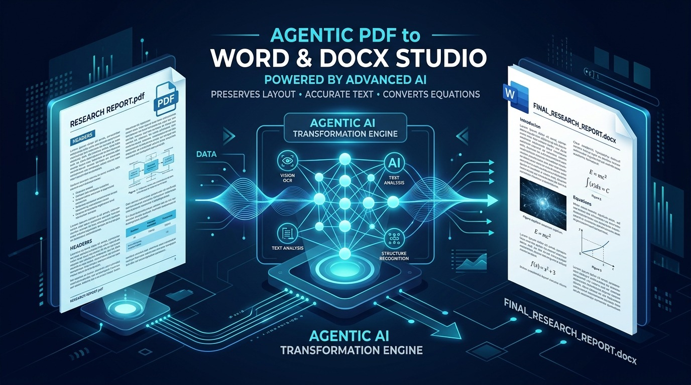

<p align="center">
  
</p>

<div align="center">

# 🚀 Agentic PDF to Word & DOCX Studio
### Autonomous AI Agent Pipeline: Convert Multi-Page PDFs into Clean Markdown and Publication-Grade Word & PDF Documents

[](https://python.org)
[](https://www.iso.org/standard/71691.html)
[](https://antigravity.google)
[](https://github.com)
[](LICENSE)

<br/>

<p align="center">
  <b>🇬🇧 English</b> • <a href="README.md"><b>🇮🇷 مطالعه به زبان فارسی (Persian Documentation)</b></a>
</p>

<br/>

**[💡 Core Mission](#-core-mission)** • **[🧩 The 2-Engine 2-Prompt Framework](#-the-2-engine--2-prompt-architecture)** • **[⚡ Quick Start](#-quick-start--installation)** • **[🛠️ 4-Step Pipeline](#️-step-by-step-pipeline-execution)** • **[🖥️ Windows GUI](#️-windows-gui-studio)**

</div>

---

## 💡 Core Mission

> [!NOTE]
> **The Problem:** Extracting long (50–500 page) PDF books, scanned handouts, and academic papers into Microsoft Word has always suffered from critical failures:
> 1. **Context Bloat:** After 15–20 pages, LLMs exhaust their memory window, slowing down, hallucinating, or halting entirely.
> 2. **Flipped Parentheses:** Bidirectional mixed text (Persian/Arabic + English/Chemistry) flips parentheses (e.g. `(Cl⁻)` becomes `)Cl⁻(`) and misaligns signs.
> 3. **Blurry Equations:** Math formulas get converted to ugly pixelated raster images.
>
> **The Solution:** A transparent **2-Engines & 2-Prompts** architecture that processes books of any length with **zero context bloat**, compiling them into publication-quality Microsoft Word (`.docx`) and native vector PDF files featuring standard typography (`B Nazanin`, `B Titr`, `Times New Roman`), native vector Office Math (OMML), and dynamic Tables of Contents.

---

## 🧩 The 2-Engine & 2-Prompt Architecture

The pipeline divides book extraction and document compilation into 4 deterministic stages:

```mermaid
flowchart LR
    A["📄 PDF Book / Document"] -->|"Engine 1<br/>scripts/pdf_to_cache.py"| B["🖼️ 1050px Image Cache<br/>(page_cache/)"]
    B -->|"Prompt 1"| C["📝 Styling Reference<br/>(styling_reference.md)"]
    C -->|"User Approval ✅"| D["🚀 Prompt 2 with /goal<br/>(Page-by-page extraction)"]
    D -->|"Append with Zero Bloat"| E["📋 Full Document<br/>document.md"]
    E -->|"Engine 2<br/>md2docx CLI / GUI"| F["📘 Final Word (.docx)<br/>& Academic PDF"]

    style A fill:#1e293b,stroke:#38bdf8,stroke-width:2px,color:#fff
    style B fill:#0f172a,stroke:#38bdf8,stroke-width:2px,color:#fff
    style C fill:#1e1b4b,stroke:#a855f7,stroke-width:2px,color:#fff
    style D fill:#321e81,stroke:#a855f7,stroke-width:2px,color:#fff
    style E fill:#064e3b,stroke:#10b981,stroke-width:2px,color:#fff
    style F fill:#065f46,stroke:#34d399,stroke-width:3px,color:#fff
```



1. **Engine 1 (PDF to Image Cache Engine):** High-speed multithreaded rendering of all PDF pages into lightweight, standardized 1050px JPEGs (`scripts/pdf_to_cache.py`).
2. **Prompt 1 (Template Markdown Generator):** The AI inspects a single representative page and establishes `styling_reference.md`.
3. **User Approval Checkpoint:** You inspect and green-light the formatting conventions.
4. **Prompt 2 (Autonomous `/goal` Loop):** The AI extracts sequential pages one by one into a temp buffer and appends them via Python CLI, maintaining a 100% clean memory context.
5. **Engine 2 (Markdown to DOCX & PDF Engine):** The `md2docx` engine compiles the markdown into academic Word & PDF documents with native OMML formulas, RTL tables, and cover pages.

---

## 🌟 Feature Comparison Matrix

| Feature | Conventional Tools (Pandoc / Abbyy / ChatGPT) | Agentic PDF-to-Word Studio |
| :--- | :--- | :--- |
| **Document Length** | Capped at 10–20 pages due to memory exhaustion | **Unlimited (100+ pages)** via sequential appending (Zero Context Bloat) |
| **Bilingual & Chemical Text** | Parentheses and signs flip (`(Cl⁻)` -> `)Cl⁻(`) | **Tokenized Run Generation:** Exactly 0% flipped punctuation |
| **Math Equations (LaTeX)** | Low-res raster images or unformatted text | **Native Office Math (OMML):** Sharp, vector, fully editable equations |
| **Scientific References** | English citations invert years and initials | **Reference BIDI Isolation:** Pure LTR for APA/IEEE; RTL for Persian citations |
| **Tables & Callouts** | Simple LTR tables and plain blockquotes | **Booktabs Tables:** RTL layout with repeating header rows (`tblHeader`) |
| **Cover Page & TOC** | Manual and lacking formal academic layout | **Academic Cover & TOC:** Universal academic seal with dynamic Word field (`w:sdt`) |
| **PDF Export** | Broken browser prints with misaligned fonts | **Native Word COM Automation:** 100% exact vector typography |

---

## ⚡ Quick Start & Installation

Prerequisite: **Python 3.10+**. Clone the repository and install dependencies:

```bash
# 1. Clone the repository
git clone https://github.com/faithsaly5-stack/Antigravity-PDF-to-Docx.git
cd Antigravity-PDF-to-Docx

# 2. Install dependencies
pip install -r requirements.txt
```

---

## 🛠️ Step-by-Step Pipeline Execution

### Step 1: Run Engine 1 (PDF to Image Cache)
Place your target PDF into the workspace folder and execute the multithreaded caching script (~35 pages/sec):
```bash
python scripts/pdf_to_cache.py "book.pdf"
```

> [!TIP]
> This creates a `page_cache/` folder containing optimized JPEGs with a standardized width of 1050 pixels (the optimal balance for AI vision models).

---

### Step 2: Run Prompt 1 (Generate Styling Reference)
Send this prompt to your AI Agent (Google Antigravity, Claude Sonnet 5.5, GPT-6 Astra / Sol, Gemini 4 Argon, DeepSeek-V4-Pro, or Grok 4.7):

<details open>
<summary><b>📋 Prompt 1: Template Markdown Generator (Click to Copy)</b></summary>

```text
Prepare the environment by converting a PDF into optimized JPEGs, and then extract a single sample page to establish the ground-truth Markdown styling reference for a bulk OCR pipeline.

### 📝 Phase 1: PDF to Image Conversion
1. Identify the target .pdf file in the current working directory.
2. Delete the folders page_cache and any previous test images if they exist.
3. Run python scripts/pdf_to_cache.py (or create a script using pymupdf that renders each page to exactly 1050px width, quality=70, saving to page_cache/page_001.jpg, etc.).
4. Wait until all images are successfully saved.

### 📝 Phase 2: Create Styling Reference
5. Open the first representative page (e.g. page_cache/page_001.jpg).
6. Transcribe the text with maximum accuracy, proper RTL/Persian alignment, LaTeX equations ($...$), and tables.
7. Apply strict Markdown rules:
   - Headings with proper levels (# , ## ) and a space after #.
   - Callout blocks (> [!NOTE] or > ) for tips/warnings.
   - Bold text (**text**) for terms and emphasis.
8. Save this output into styling_reference.md and request confirmation from the user.
```
</details>

**User Approval:** Open `styling_reference.md` and check the headings and formatting. Once you are satisfied, proceed to Step 3.

---

### Step 3: Run Prompt 2 (Autonomous Extraction Loop via `/goal`)
Send this prompt to initiate the autonomous, zero-bloat loop:

<details open>
<summary><b>🚀 Prompt 2: Autonomous Extraction Loop (Click to Copy)</b></summary>

```text
/goal Resume the strict OCR text extraction of the pictures in the `page_cache` folder into `document.md` efficiently, without ANY image cropping or context bloat.

### 📝 Execution Steps
1. Use a terminal command (e.g., Get-Content document.md -Tail 20 or tail -n 20 document.md) to inspect ONLY the end of document.md to identify the last processed page.
2. Read styling_reference.md to follow exact styling conventions.
3. DO NOT load or read the full document.md into your context to prevent memory bloat.
4. Select the VERY NEXT sequential image from the page_cache folder.
5. Extract all text, equations, and tables accurately, formatting according to styling_reference.md.
6. Write this output into temp_page.md.
7. Run this Python terminal command to append the content:
   python -c "with open('temp_page.md', 'r', encoding='utf-8') as src, open('document.md', 'a', encoding='utf-8') as dst: dst.write('\n\n' + src.read().strip() + '\n'); print('Appended successfully')"
8. Clear temp_page.md, reset contextual memory of the current page, and loop back to Step 4 until all pages are extracted.
```
</details>

---

### Step 4: Run Engine 2 (Markdown to Academic Word & PDF)
Once `document.md` is complete, compile it into an academic Word document and native PDF:

```bash
# Academic Mode: Includes cover page, dynamic TOC, and vector headers
python -m md2docx document.md -o "Final_Book.docx" --academic --pdf
```

> [!IMPORTANT]
> You can also double-click [`Start_Markdown_Studio.bat`](Start_Markdown_Studio.bat) to launch the **Windows GUI Studio** and perform conversion with a single click!

---

## 🖥️ Windows GUI Studio

For users who prefer a graphical desktop interface:

<div align="center">
  <p><b>Launch with a double-click:</b> <code>Start_Markdown_Studio.bat</code> or run <code>python run_gui.py</code></p>
</div>

* 📂 **Batch File Selection:** Browse and select single or multiple Markdown files simultaneously.
* ⚙️ **One-Click Toggles:** Enable academic template, direct Word COM PDF export, and custom font selection (`B Nazanin`, `Vazirmatn`, `IRANYekan`, `Times New Roman`).
* 📊 **Live Element Counter:** Instant metrics on processed headings, tables, code blocks, and math equations.
* 🚀 **Post-Conversion Actions:** Buttons to "Open in Word", "View PDF", or "Reveal in Explorer".

---

## 🤖 Antigravity Agent Skill Integration

This repository includes a native workspace skill:
* **Skill Path:** [`.agents/skills/agentic-pdf-to-docx/SKILL.md`](.agents/skills/agentic-pdf-to-docx/SKILL.md)
* When opened in **Google Antigravity IDE**, the agent automatically discovers this workflow. Simply ask:
  > *"Convert book.pdf into Word and PDF"*
  The agent executes image caching, creates the style template, runs the extraction loop, and produces the final DOCX and PDF documents autonomously.

---

## 📁 Repository Structure

```
perfect markdown to docx/
├── assets/
│   ├── hero_banner.jpg      # Official project banner graphic
│   └── MML2OMML.XSL         # Microsoft XSL stylesheet for MathML -> OMML
├── scripts/
│   └── pdf_to_cache.py      # Engine 1: Multithreaded 1050px image cache extractor
├── .agents/skills/
│   ├── agentic-pdf-to-docx/ # Antigravity Skill: Autonomous PDF-to-Word pipeline
│   ├── persian-word-report/ # Antigravity Skill: Academic typography & thesis layouts
│   └── persian-word-edit/   # Antigravity Skill: Targeted OpenXML editing
├── md2docx/                 # Engine 2: Markdown to DOCX & PDF conversion engine
│   ├── bidi.py              # Run tokenization & bidirectional isolation
│   ├── math_parser.py       # LaTeX to native OMML vector math converter
│   ├── docx_builder.py      # OpenXML document builder, Booktabs tables, Callouts
│   ├── cover_engine.py      # Academic cover page & dynamic Table of Contents
│   ├── gui.py               # Modern CustomTkinter Windows desktop application
│   └── word_com.py          # Native Word COM automation for fields & PDF export
├── templates/
│   └── default_academic.docx# Standard academic template with universal crest
├── samples/
│   ├── sample_persian_academic.md # Chemistry academic report with formulas & tables
│   └── sample_tech_report.md      # Technical report with diagram & callouts
├── tests/
│   └── test_verify.py       # Typographic verification and OpenXML test suite
├── docs/                    # Supplementary guides & social announcements
│   ├── Agentic_Bulk_OCR_Guide.md # Comprehensive bilingual guide for OCR prompts
│   ├── CHANNEL_POST_FA.md   # Ready-to-publish Persian social announcement
│   └── CHANNEL_POST_EN.md   # Ready-to-publish English social announcement
├── scripts/                 # Automation & deployment scripts
│   └── github_deployer.js   # 1-click GitHub deployment engine
├── deploy_to_github.bat     # Windows 1-click push to GitHub launcher
├── Start_Markdown_Studio.bat# Windows batch launcher for GUI Studio
├── run_gui.py               # GUI launcher script
├── convert.py               # Root CLI launcher script
├── LICENSE                  # MIT License
└── pyproject.toml           # Package configuration & dependencies
```

---

## 🧪 Quality Assurance & Schema Validation

Verify OpenXML compliance and run typographic test assertions:

```bash
# Run test suite
python tests/test_verify.py

# OpenXML schema validation via OfficeCLI (optional)
officecli validate templates/default_academic.docx
```

---

## 📄 License

This project is licensed under the **MIT License**. Free for personal, academic, and commercial use.
<br/>
Compatible with state-of-the-art vision and reasoning models (Gemini 4 Argon, GPT-6 Astra / Sol, Claude Sonnet 5.5, DeepSeek-V4-Pro, Llama 4, Grok 4.7).
