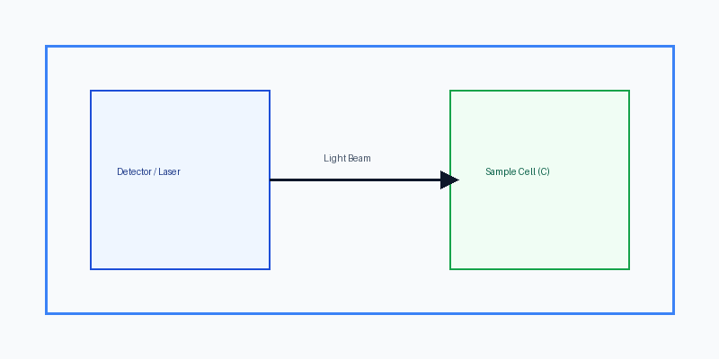

# ۱. معرفی سیستم

سیستم طراحی‌شده، داده‌های طیف‌سنجی جذبی را به صورت بلادرنگ دریافت کرده و پارامترهای ترمودینامیکی و سینتیکی واکنش‌های کمپلکس را تخمین می‌زند. برای کسب اطلاعات بیشتر می‌توانید به وب‌سایت [دانشگاه صنعتی شریف](https://sharif.edu) مراجعه فرمایید.

## ۱.۱. معماری سخت‌افزار

شماتیک ساختار سخت‌افزاری ماژول سنسور و سل اندازه‌گیری در شکل زیر نمایش داده شده است:



> [!TIP]
> استفاده از سل کووت کوارتزی با گذردهی بالا در ناحیه فرابنفش ($\lambda < 350\text{ nm}$) الزامی است.

---

# ۲. مدلسازی ریاضی و الگوریتم رگرسیون

معادله کلی سرعت واکنش برای فرآیند مرتبه اول به صورت زیر تعریف می‌شود:

$$
-\frac{d[A]}{dt} = k [A] \implies \ln \left( \frac{[A]_0}{[A]} \right) = kt
$$

ضریب نفوذ فاز مایع بر اساس رابطه استوکس-اینشتین ($D = \frac{k_B T}{6 \pi \eta r}$) محاسبه گردیده و پارامتر غلظت با دقت $C = 1.25 \times 10^{-3}\text{ M}$ ارزیابی می‌شود.

```python
import numpy as np

def kinetic_rate(time_points: np.ndarray, conc_initial: float, k_rate: float) -> np.ndarray:
    """محاسبه پروفایل زمانی غلظت گونه واکنش‌دهنده"""
    return conc_initial * np.exp(-k_rate * time_points)
```

---

# ۳. جمع‌بندی و مراحل آتی

- [x] کالیبراسیون فتودیود با چشمه لیزری دیودی
- [x] پیاده‌سازی فیلتر کالمن برای کاهش نوفه اندازه‌گیری
- [ ] آزمایش در دماهای متفاوت جهت تعیین انرژی فعال‌سازی ($E_a$)
